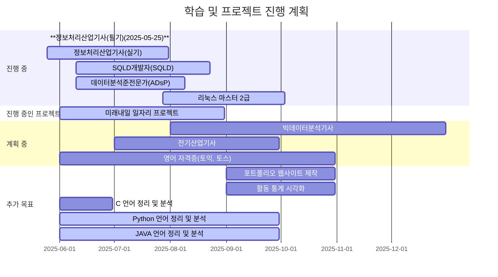

<!-- 헤더 -->

  

 

<!-- 자기소개 -->
<h2 align="center">🙋‍♂️ 안녕하세요, 김주영입니다!</h2>

  현재 Python을 중심으로 백엔드 개발, 알고리즘, 데이터 처리 분야에 관심을 갖고 공부하고 있으며, 
  간단한 프로젝트와 실습을 통해 꾸준히 실력을 다지고 있습니다. 
   
  AI랑 자동화, 그리고 데이터를 더 효율적으로 다루는 방법에 관심이 많습니다. 
  요즘은 사용자가 편하게 느낄 수 있는 기능 만들기나 
  깔끔하고 정리된 프로젝트 구조 짜기 같은 부분에도 관심을 가지고 있습니다. 
   
  어떻게 하면 코드를 더 효율적으로 작성할 수 있는지,완성도 높은 프로젝트를 만들기 위해 꾸준히 고민하고 학습하고 있습니다. 

  

📌 더 자세한 정보는 아래 노션 링크에서 확인하실 수 있습니다 👇  
### [ 이력서 보기](https://gold-century-3b0.notion.site/Kim-Ju-Young-1ad3bfade932802b9be3d6a2b74de08d?pvs=4)  
### [ 필기 노트 보기](https://gold-century-3b0.notion.site/2025-1ac3bfade93280eb9571e8d3f97096e4?pvs=74)

  

---

### 🎓 Education / 학력

- **2025**  
  🤖 한국폴리텍 정수캠퍼스  
  인공지능소프트웨어과정 수료 예정 (2025.03 ~ 12)

- **2017 ~ 2020**  
  ✈️ 동서울대학교 항공기계과 졸업 (2·3년제 전문학사)

### 🏆 Contests / 공모전
- 2025.05 미래내일일경험 프로젝트형 - <b> 우울증 예방을 위한 AI 에이전트 기반 자동일기 앱 ~ing </b>

### 🗃️ Ropositories / 레포지토리
[ 파이썬 문제풀이 모음집](https://github.com/KmK0708/py_codeSolve.git)

<!-- 스택 섹션 -->
<h2 align="center">🛠 Stack</h2>

  
### 💻 Language

### 🧰 Tools & IDE

### 🔧 Version Control

### 🗄️ Database

  

# ✏️ 중단기 목표 및 일정
현재 자격증 취득과 프로젝트 진행을 병행하며, 학습과 실습을 체계적으로 관리하고 있습니다.

<!-- 푸터 -->

  

